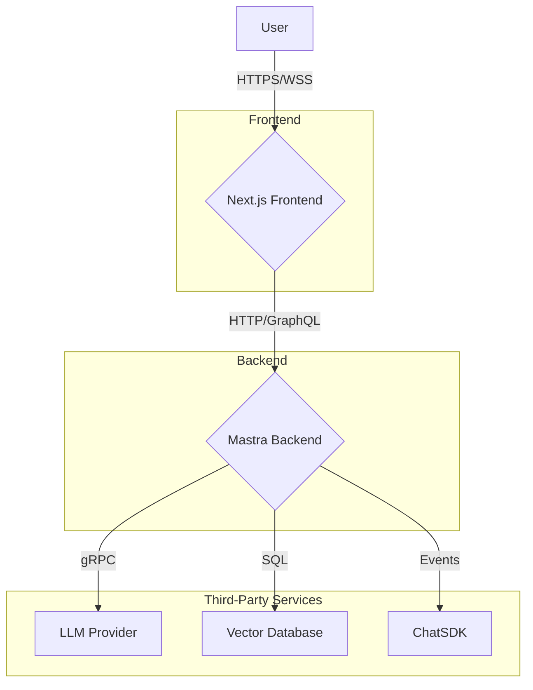
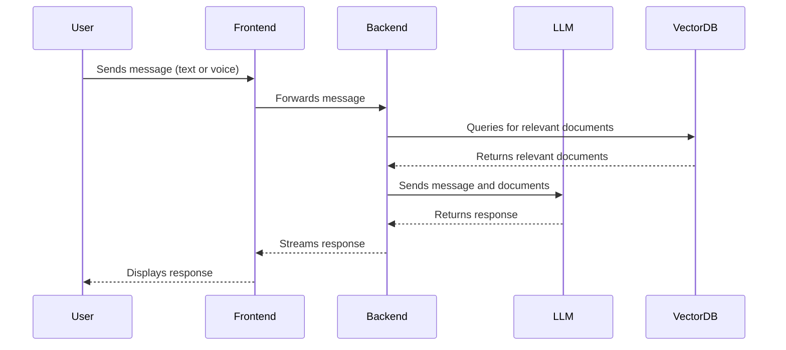

## RoboRail Assistant: Product Requirements Document (PRD)

### 1. Overview

The RoboRail Assistant is an AI-powered agent designed to provide expert support for the RoboRail machine, manufactured by HGG Profiling Equipment b.v. It will serve as a primary resource for operators, maintenance personnel, and technicians, offering instant access to technical documentation, troubleshooting guidance, and operational instructions. The assistant will be accessible through a web-based chat interface and will support both text and voice interactions.

### 2. Goals

*   **Improve Efficiency:** Reduce the time it takes for users to find information and resolve issues with the RoboRail machine.
*   **Enhance Safety:** Promote safe operation and maintenance practices by providing clear and concise safety warnings and procedures.
*   **Increase Accessibility:** Make technical information available 24/7 through a user-friendly interface.
*   **Reduce Support Costs:** Offload common questions and troubleshooting tasks from human support agents.

### 3. User Personas

*   **Machine Operator:** Responsible for the day-to-day operation of the RoboRail. Needs quick access to operating procedures and basic troubleshooting steps.
*   **Maintenance Technician:** Performs routine maintenance and repairs on the RoboRail. Requires detailed technical specifications, maintenance schedules, and advanced troubleshooting guides.
*   **Safety Officer:** Ensures that all operations are conducted in a safe and compliant manner. Needs access to safety manuals and procedures.

### 4. Features

#### 4.1. RAG-based Question Answering

*   The assistant will use a Retrieval-Augmented Generation (RAG) system to answer questions based on a corpus of technical documents, including user manuals, maintenance guides, and safety protocols.
*   The system will be able to ingest and process various document formats, including PDF, DOCX, and HTML.
*   The RAG system will be optimized for accuracy and relevance, providing users with the most pertinent information from the knowledge base.

#### 4.2. Multi-Turn Conversations

*   The assistant will be able to maintain context across multiple turns of a conversation, allowing for more natural and effective interactions.
*   Users will be able to ask follow-up questions and refine their queries without having to restate the initial context.
*   The conversation history will be persisted, allowing users to resume their conversations at a later time.

#### 4.3. Voice Interaction

*   The assistant will support speech-to-speech interaction, allowing users to ask questions and receive answers using their voice.
*   The system will use a high-quality text-to-speech (TTS) and speech-to-text (STT) engine to ensure clear and accurate communication.
*   The voice interaction will be designed to be hands-free, allowing users to interact with the assistant while working on the machine.

#### 4.4. User Interface

*   The user interface will be a clean and intuitive web-based chat application.
*   The UI will support both text and voice input.
*   The UI will display the assistant's responses in a clear and readable format, with support for code blocks and other formatting.

### 5. Non-Functional Requirements

*   **Performance:** The assistant should respond to user queries within 2-3 seconds.
*   **Scalability:** The system should be able to handle a large number of concurrent users without a degradation in performance.
*   **Security:** All user data and communications will be encrypted and stored securely.
*   **Reliability:** The system will have an uptime of 99.9%.

### 6. Success Metrics

*   **User Satisfaction:** Measured through user feedback and ratings.
*   **Task Completion Rate:** The percentage of user queries that are successfully resolved by the assistant.
*   **Reduction in Support Tickets:** A decrease in the number of support tickets related to common questions and issues.
*   **Adoption Rate:** The number of active users of the RoboRail Assistant.

## Architecture

### High-Level Architecture



### Data Flow



## Implementation Guide

This project will be implemented in a series of vertical slices, each representing a complete, testable, and deployable increment of functionality. We will follow a TDD workflow, with feature branches and conventional commits.

### Slice 1: Basic Project Setup

**Objective:** To set up the basic project structure, including the Next.js frontend and the Mastra backend.

**Implementation Tasks:**

1.  **Initialize Next.js Project:**
    *   Create a new Next.js project using `create-next-app`.
    *   Set up TypeScript and ESLint.
2.  **Initialize Mastra Project:**
    *   Initialize a new Mastra project within the Next.js project.
    *   Configure the Mastra development server.
3.  **Create Basic UI:**
    *   Create a simple chat interface using React and CSS.
    *   The UI should have an input field for text messages and a display area for the conversation.
4.  **Create Mastra Agent:**
    *   Create a simple Mastra agent that can respond to a "hello" message.
    *   Configure the agent with the RoboRail system prompt.
5.  **Connect Frontend to Backend:**
    *   Create an API route in Next.js to handle requests from the frontend.
    *   The API route will forward messages to the Mastra agent and return the agent's response.
6.  **Testing:**
    *   Write a unit test for the Mastra agent.
    *   Write a unit test for the Next.js API route.

**Definition of Done:**

*   The Next.js and Mastra projects are set up and configured.
*   The basic chat UI is implemented.
*   The Mastra agent can respond to a "hello" message.
*   The frontend can send a message to the backend and receive a response.
*   All tests pass.

### Slice 2: RAG Integration

**Objective:** To integrate the RAG system, allowing the assistant to answer questions based on technical documents.

**Implementation Tasks:**

1.  **Set up Vector Database:**
    *   Choose a vector database (e.g., Pinecone, Weaviate, or a local option for development).
    *   Configure the database and create a new index.
2.  **Implement Document Ingestion:**
    *   Create a script to ingest and process technical documents.
    *   The script should chunk the documents, generate embeddings, and store them in the vector database.
3.  **Update Mastra Agent:**
    *   Update the Mastra agent to use the RAG system.
    *   The agent should query the vector database for relevant documents and use them to generate a response.
4.  **Testing:**
    *   Write a unit test for the document ingestion script.
    *   Write a unit test for the Mastra agent's RAG functionality.
    *   Write an integration test to verify that the entire RAG pipeline is working correctly.

**Definition of Done:**

*   The vector database is set up and configured.
*   The document ingestion script is implemented and can process technical documents.
*   The Mastra agent can answer questions based on the ingested documents.
*   All tests pass.

### Slice 3: Multi-Turn Conversations

**Objective:** To enable the assistant to maintain context across multiple turns of a conversation.

**Implementation Tasks:**

1.  **Implement Conversation History:**
    *   Use a database or in-memory store to persist the conversation history.
    *   Each conversation should have a unique ID.
2.  **Update Mastra Agent:**
    *   Update the Mastra agent to include the conversation history in the prompt.
    *   This will allow the agent to maintain context and respond to follow-up questions.
3.  **Update UI:**
    *   Update the UI to display the full conversation history.
    *   Users should be able to scroll through the conversation.
4.  **Testing:**
    *   Write a unit test for the conversation history service.
    *   Write a unit test for the Mastra agent's multi-turn functionality.
    *   Write an end-to-end test to verify that the assistant can hold a multi-turn conversation.

**Definition of Done:**

*   The conversation history is persisted and can be retrieved.
*   The Mastra agent can maintain context across multiple turns of a conversation.
*   The UI displays the full conversation history.
*   All tests pass.

### Slice 4: Voice Interaction

**Objective:** To add speech-to-speech interaction to the assistant.

**Implementation Tasks:**

1.  **Integrate Mastra Voice:**
    *   Integrate the Mastra Voice library into the backend.
    *   Configure the voice service with a STT and TTS provider (e.g., OpenAI).
2.  **Update Mastra Agent:**
    *   Update the Mastra agent to handle voice input and output.
    *   The agent should be able to receive audio from the frontend, convert it to text, and send an audio response back.
3.  **Update UI:**
    *   Add a microphone button to the UI to enable voice input.
    *   The UI should be able to play the assistant's audio response.
4.  **Testing:**
    *   Write a unit test for the voice service.
    *   Write an end-to-end test to verify that the speech-to-speech interaction is working correctly.

**Definition of Done:**

*   The Mastra Voice library is integrated and configured.
*   The Mastra agent can handle voice input and output.
*   The UI supports voice interaction.
*   All tests pass.

---
## File Structure

```
.
├── .env.local
├── .eslintrc.json
├── .gitignore
├── next.config.mjs
├── package.json
├── postcss.config.mjs
├── public
│   ├── next.svg
│   └── vercel.svg
├── src
│   ├── app
│   │   ├── api
│   │   │   └── chat
│   │   │       └── route.ts
│   │   ├── globals.css
│   │   ├── layout.tsx
│   │   └── page.tsx
│   ├── lib
│   │   ├── mastra
│   │   │   ├── agent.ts
│   │   │   └── index.ts
│   │   └── zod
│   │       └── types.ts
│   └── tests
│       └── mastra
│           └── agent.test.ts
├── tailwind.config.ts
└── tsconfig.json
```

---

## Slice 1: Basic Project Setup - Implementation

### `src/lib/mastra/agent.ts`

```typescript
import { Agent } from '@mastra/core';
import { openai } from '@ai-sdk/openai';
import { z }from 'zod';
import { RoboRailSystemPrompt } from './prompts';
import { Message } from 'ai';

export const RoboRailAgent = new Agent({
  name: 'RoboRailAgent',
  instructions: RoboRailSystemPrompt,
  model: openai('gpt-4-turbo'),
  memory: {
    // This will be configured in a later slice
  },
  tools: {
    // This will be configured in a later slice
  },
});

export const ChatRequest = z.object({
  messages: z.array(z.custom<Message>()),
});

```

### `src/lib/mastra/index.ts`

```typescript
import { Mastra } from '@mastra/core';
import { RoboRailAgent } from './agent';

export const mastra = new Mastra({
  agents: {
    RoboRailAgent,
  },
});

```

### `src/lib/zod/types.ts`

```typescript
import { z } from 'zod';

export const MessageSchema = z.object({
  id: z.string(),
  role: z.enum(['user', 'assistant']),
  content: z.string(),
});

export const ChatRequestSchema = z.object({
  messages: z.array(MessageSchema),
});
```

### `src/app/api/chat/route.ts`

```typescript
import { mastra } from '@/lib/mastra';
import { ChatRequestSchema } from '@/lib/zod/types';
import { NextRequest, NextResponse } from 'next/server';

export async function POST(req: NextRequest) {
  try {
    const body = await req.json();
    const { messages } = ChatRequestSchema.parse(body);

    const agent = mastra.getAgent('RoboRailAgent');

    const result = await agent.generate(messages);

    return NextResponse.json(result);
  } catch (error) {
    console.error(error);
    return NextResponse.json({ error: 'Internal Server Error' }, { status: 500 });
  }
}
```

### `src/tests/mastra/agent.test.ts`

```typescript
import { mastra } from '@/lib/mastra';
import { Message } from 'ai';

describe('RoboRailAgent', () => {
  it('should respond to a hello message', async () => {
    const agent = mastra.getAgent('RoboRailAgent');
    const messages: Message[] = [{
      id: '1',
      role: 'user',
      content: 'Hello',
    }];
    const result = await agent.generate(messages);
    expect(result.text).toBeDefined();
  });
});

```

### `src/app/page.tsx`

```typescript
'use client';

import { useChat } from 'ai/react';
import { useState } from 'react';

export default function Chat() {
  const { messages, input, handleInputChange, handleSubmit } = useChat();
  const [voiceEnabled, setVoiceEnabled] = useState(false);

  const handleVoiceClick = () => {
    setVoiceEnabled(!voiceEnabled);
    // In a later slice, we will add the logic to handle voice input
  };

  return (
    <div className="flex flex-col w-full max-w-md py-24 mx-auto stretch">
      {messages.map(m => (
        <div key={m.id} className="whitespace-pre-wrap">
          <strong>{m.role === 'user' ? 'User: ' : 'AI: '}</strong>
          {m.content}
        </div>
      ))}

      <form onSubmit={handleSubmit}>
        <input
          className="fixed bottom-0 w-full max-w-md p-2 mb-8 border border-gray-300 rounded shadow-xl"
          value={input}
          placeholder="Say something..."
          onChange={handleInputChange}
        />
        <button
          type="button"
          className="fixed bottom-0 right-0 p-2 mb-8"
          onClick={handleVoiceClick}
        >
          {voiceEnabled ? '🎤' : '🤫'}
        </button>
      </form>
    </div>
  );
}
```

**To run the tests:**

```bash
npm test
```

**To start the development server:**

```bash
npm run dev
```

This first slice sets up the foundation of the application. The frontend is a simple chat interface that can send messages to the backend. The backend has a Mastra agent that can respond to messages. The next slice will build on this foundation by adding the RAG system.Excellent. Let's proceed with the next vertical slice, integrating the core RAG functionality.

## Slice 2: RAG Integration

### **Objective**

To integrate a Retrieval-Augmented Generation (RAG) system, enabling the agent to answer questions by retrieving information from a vectorized knowledge base of technical documents.

### **Context**

This slice builds upon the basic agent by giving it "knowledge." Instead of just using its pre-trained data, the agent will now be able to query a specific set of documents (the RoboRail manuals) to provide accurate, context-aware answers. This is the core feature of our assistant. We will use Vercel Postgres with the `pgvector` extension as our vector database for simplicity and integration.

### **Requirements**

*   The system must be able to load text from Markdown files.
*   The system must split documents into manageable chunks.
*   The system must generate vector embeddings for each chunk using an embedding model.
*   Embeddings and content must be stored in a Postgres database.
*   The agent must have a "tool" to query this database for relevant information based on a user's question.
*   The agent must use the retrieved information to formulate its answer.

### **Implementation Tasks**

1.  **Database Setup:**
    *   Create a script to set up the database schema, including enabling the `vector` extension and creating a table to store document chunks and embeddings.
2.  **Document Ingestion:**
    *   Create a dummy technical document (`knowledge-base/robo-manual.md`).
    *   Create an ingestion script (`src/scripts/ingest.ts`) that reads documents, chunks them, generates embeddings, and saves them to the database.
3.  **RAG Search Tool:**
    *   Create a new tool for the Mastra agent (`src/lib/mastra/tools/rag.ts`).
    *   This tool will take a user query, embed it, and perform a vector similarity search in the database to find relevant document chunks.
4.  **Agent Integration:**
    *   Update the `RoboRailAgent` to include and use the new RAG search tool.
5.  **Testing (TDD):**
    *   Write a test for the ingestion script to ensure it processes and stores documents correctly.
    *   Write a test for the RAG tool to verify it can retrieve data from the database.

### **Definition of Done**

*   The database schema script is created and works.
*   The ingestion script successfully populates the database with document chunks and embeddings.
*   The `RoboRailAgent` is equipped with a RAG tool.
*   The agent can successfully use the tool to retrieve context and answer a question based on the dummy document.
*   All new tests pass.

---

### **Implementation Guide (Slice 2)**

#### **Step 1: Update Project Dependencies**

First, let's add the necessary packages for database access, vector operations, and embeddings.

```bash
npm install @vercel/postgres pg @ai-sdk/cohere zod
```

#### **Step 2: Create Dummy Knowledge Base**

Create a folder and a file to represent our technical documentation.

**File: `knowledge-base/robo-manual.md`**

```markdown
# RoboRail Machine Manual

## Chapter 1: Safety Procedures

Safety is paramount when operating the RoboRail. Always wear appropriate personal protective equipment (PPE), including safety glasses and steel-toed boots. Never bypass safety sensors or guards. The primary emergency stop button is located on the main control panel, colored red.

## Chapter 2: Machine Operation

To start the machine, first ensure the area is clear of personnel and debris. Second, turn the main power key to the 'ON' position. Third, press the green 'SYSTEM START' button on the control panel. The machine will perform a self-check, which takes approximately 30 seconds.

## Chapter 3: Troubleshooting

**Problem:** Machine does not start.
**Solution:**
1. Verify the main power key is in the 'ON' position.
2. Check if the emergency stop button has been pressed. If so, twist to release it.
3. Confirm power is supplied to the machine.
```

#### **Step 3: Create Database Setup Script**

This script will prepare our Vercel Postgres database to store vectors.

**File: `src/scripts/setup-db.ts`**

```typescript
// src/scripts/setup-db.ts
import { db } from '@vercel/postgres';

async function setupDatabase() {
  const client = await db.connect();
  try {
    // Enable the pgvector extension
    await client.sql`CREATE EXTENSION IF NOT EXISTS vector`;
    console.log('Vector extension enabled.');

    // Create the documents table
    // The embedding dimension (1024) must match the Cohere model's output
    await client.sql`
      CREATE TABLE IF NOT EXISTS documents (
        id SERIAL PRIMARY KEY,
        content TEXT NOT NULL,
        embedding VECTOR(1024)
      )
    `;
    console.log('Documents table created or already exists.');
  } catch (error) {
    console.error('Error setting up the database:', error);
    throw error;
  } finally {
    client.release();
  }
}

setupDatabase().then(() => {
  console.log('Database setup complete.');
  process.exit(0);
}).catch(() => {
  process.exit(1);
});
```

Add a script to `package.json` to run this:

```json
// package.json (in the "scripts" section)
"db:setup": "tsx src/scripts/setup-db.ts"
```

Now you can run `npm run db:setup` to prepare your database.

#### **Step 4: Create Document Ingestion Script**

This script will read the manual, chunk it, and store it in the database.

**File: `src/lib/ingest.ts`** (Logic for ingestion)

```typescript
// src/lib/ingest.ts
import { createCohere } from '@ai-sdk/cohere';
import { embed } from 'ai';
import { db } from '@vercel/postgres';
import { promises as fs } from 'fs';
import path from 'path';

const cohere = createCohere({ apiKey: process.env.COHERE_API_KEY });
const embeddingModel = cohere.embedding('embed-cohere-v3.0-english-v3.0');

// Simple chunking function
function chunkText(text: string, chunkSize = 250, overlap = 50): string[] {
  const chunks: string[] = [];
  for (let i = 0; i < text.length; i += chunkSize - overlap) {
    chunks.push(text.substring(i, i + chunkSize));
  }
  return chunks;
}

export async function ingestDocuments() {
  const client = await db.connect();
  try {
    const docPath = path.join(process.cwd(), 'knowledge-base', 'robo-manual.md');
    const document = await fs.readFile(docPath, 'utf-8');
    const chunks = chunkText(document);

    console.log(`Embedding ${chunks.length} chunks...`);

    const { embeddings } = await embed({
      model: embeddingModel,
      values: chunks,
    });

    console.log('Embeddings generated. Storing in database...');

    // Store chunks and embeddings in the database
    for (let i = 0; i < chunks.length; i++) {
      await client.sql`
        INSERT INTO documents (content, embedding)
        VALUES (${chunks[i]}, ${JSON.stringify(embeddings[i])})
      `;
    }
    console.log('Successfully ingested documents.');
    return { success: true, chunkCount: chunks.length };
  } catch (error) {
    console.error('Error during ingestion:', error);
    return { success: false, error };
  } finally {
    client.release();
  }
}
```

**File: `src/scripts/ingest.ts`** (Executable script)

```typescript
// src/scripts/ingest.ts
import { ingestDocuments } from '@/lib/ingest';

console.log('Starting document ingestion...');
ingestDocuments().then(({ success, chunkCount }) => {
  if (success) {
    console.log(`Ingestion complete. Stored ${chunkCount} document chunks.`);
    process.exit(0);
  } else {
    console.error('Ingestion failed.');
    process.exit(1);
  }
});
```

Add the run script to `package.json`:

```json
// package.json (in the "scripts" section)
"db:ingest": "tsx src/scripts/ingest.ts"
```

#### **Step 5: Test the Ingestion Process (TDD)**

**File: `src/tests/ingest.test.ts`**

```typescript
// src/tests/ingest.test.ts
import { ingestDocuments } from '@/lib/ingest';
import { db } from '@vercel/postgres';
import { afterAll, beforeAll, describe, expect, it } from 'vitest';

// This is an integration test and will hit a real (test) database.
describe('Document Ingestion', () => {
  beforeAll(async () => {
    // Ensure the test environment is clean
    const client = await db.connect();
    await client.sql`CREATE EXTENSION IF NOT EXISTS vector`;
    await client.sql`
      CREATE TABLE IF NOT EXISTS documents (
        id SERIAL PRIMARY KEY,
        content TEXT NOT NULL,
        embedding VECTOR(1024)
      )`;
    await client.sql`TRUNCATE documents`;
    client.release();
  });

  it('should ingest documents and store them in the database', async () => {
    const result = await ingestDocuments();
    expect(result.success).toBe(true);
    expect(result.chunkCount).toBeGreaterThan(0);

    const client = await db.connect();
    const { rowCount } = await client.sql`SELECT * FROM documents`;
    client.release();
    
    expect(rowCount).toEqual(result.chunkCount);
  }, 30000); // Increase timeout for embedding API call

  afterAll(async () => {
    // Clean up the table
    const client = await db.connect();
    await client.sql`TRUNCATE documents`;
    client.release();
  });
});
```

*Run `npm test src/tests/ingest.test.ts` to see it fail, then run `npm run db:ingest` and test again to see it pass.*

#### **Step 6: Create and Test the RAG Tool**

**File: `src/lib/mastra/tools/rag.ts`**

```typescript
// src/lib/mastra/tools/rag.ts
import { createTool } from '@mastra/core';
import { createCohere } from '@ai-sdk/cohere';
import { embed } from 'ai';
import { db } from '@vercel/postgres';
import { z } from 'zod';

const cohere = createCohere({ apiKey: process.env.COHERE_API_KEY });
const embeddingModel = cohere.embedding('embed-cohere-v3.0-english-v3.0');

export const ragTool = createTool({
  name: 'roboRailKnowledgeBase',
  description: 'Searches the RoboRail technical documentation to answer questions about operations, safety, and troubleshooting.',
  schema: z.object({
    query: z.string().describe('The question to ask the knowledge base.'),
  }),
  async execute({ query }) {
    try {
      const { embedding } = await embed({
        model: embeddingModel,
        value: query,
      });

      const client = await db.connect();
      // Find the 3 most similar documents
      const { rows } = await client.sql`
        SELECT content FROM documents
        ORDER BY embedding <=> ${JSON.stringify(embedding)}
        LIMIT 3
      `;
      client.release();

      const context = rows.map((row: { content: string }) => row.content).join('\n---\n');
      return { context };

    } catch (error) {
      console.error("Error searching knowledge base:", error);
      return { error: 'Failed to search knowledge base.' };
    }
  },
});
```

#### **Step 7: Update Agent to Use the Tool**

Now, we add the tool to our agent.

**File: `src/lib/mastra/agent.ts`** (Updated)

```typescript
// src/lib/mastra/agent.ts
import { Agent } from '@mastra/core';
import { openai } from '@ai-sdk/openai';
import { z } from 'zod';
import { RoboRailSystemPrompt } from './prompts'; // Assume prompts are moved to their own file
import { Message } from 'ai';
import { ragTool } from './tools/rag'; // <-- IMPORT THE TOOL

export const RoboRailAgent = new Agent({
  name: 'RoboRailAgent',
  instructions: RoboRailSystemPrompt,
  model: openai('gpt-4-turbo'),
  memory: {
    // This will be configured in a later slice
  },
  tools: {
    knowledgeSearch: ragTool, // <-- ADD THE TOOL
  },
});

export const ChatRequest = z.object({
  messages: z.array(z.custom<Message>()),
});
```

#### **Step 8: Final Integration Test**

Let's write a final test to ensure the agent uses the tool correctly.

**File: `src/tests/mastra/agent-rag.test.ts`**

```typescript
// src/tests/mastra/agent-rag.test.ts
import { RoboRailAgent } from '@/lib/mastra/agent';
import { ingestDocuments } from '@/lib/ingest';
import { db } from '@vercel/postgres';
import { afterAll, beforeAll, describe, expect, it } from 'vitest';
import { Message } from 'ai';

describe('RoboRailAgent with RAG tool', () => {
  // Before tests, ingest the documents so the agent has knowledge
  beforeAll(async () => {
    const client = await db.connect();
    await client.sql`CREATE EXTENSION IF NOT EXISTS vector`;
    await client.sql`
      CREATE TABLE IF NOT EXISTS documents (
        id SERIAL PRIMARY KEY,
        content TEXT NOT NULL,
        embedding VECTOR(1024)
      )`;
    await client.sql`TRUNCATE documents`;
    client.release();
    await ingestDocuments();
  }, 40000);

  it('should use the knowledge base to answer a specific question', async () => {
    const messages: Message[] = [{
      id: '1',
      role: 'user',
      content: 'How do I start the machine?',
    }];
    
    const result = await RoboRailAgent.generate(messages);

    // Check that the response is relevant and likely came from the manual
    expect(result.text.toLowerCase()).toContain('control panel');
    expect(result.text.toLowerCase()).toContain('green');
    expect(result.text.toLowerCase()).toContain('self-check');
  }, 40000); // Increase timeout for LLM and tool calls

  afterAll(async () => {
    const client = await db.connect();
    await client.sql`TRUNCATE documents`;
    client.release();
  });
});
```

Run `npm test src/tests/mastra/agent-rag.test.ts`. After a few moments for the API calls, the test should pass, confirming the entire RAG flow is working. You have now successfully completed Slice 2.Of course. Let's move on to the final slice for this implementation guide, which introduces voice capabilities.

## Slice 4: Voice Interaction (Speech-to-Speech)

### **Objective**

To add speech-to-speech interaction, allowing users to speak their questions to the agent and hear the responses spoken back to them.

### **Context**

For users operating machinery, hands-free interaction is a significant advantage. This slice integrates Mastra's voice capabilities to create a more accessible and versatile assistant. We will use a client-side library to handle microphone input and audio playback, which will communicate with a dedicated backend endpoint for real-time speech-to-text (STT) and text-to-speech (TTS) processing.

### **Requirements**

-   A new API route (`/api/voice`) to handle the bidirectional WebSocket communication for voice.
-   Integration of a real-time STT service (e.g., Deepgram, AssemblyAI).
-   Integration of a TTS service (e.g., OpenAI, ElevenLabs) to convert the agent's text response to audio.
-   The frontend must be able to record audio from the user's microphone.
-   The frontend must be able to play back the audio stream received from the server.
-   The UI needs a "microphone" button to toggle the recording state.

### **Implementation Tasks**

1.  **Install Dependencies:**
    *   Add the Mastra voice client and necessary libraries for voice processing.
2.  **Create Voice API Route:**
    *   Implement a new API route at `src/app/api/voice/route.ts`.
    *   This route will use the `createVoice` handler from `@mastra/voice/server` to manage the WebSocket connection.
3.  **Configure Voice Agent:**
    *   The `createVoice` handler needs to be configured with an STT provider, a TTS provider, and the core logic for generating a text response (our existing `RoboRailAgent`).
4.  **Frontend Integration:**
    *   Create a custom React hook, `useVoiceAssistant`, to encapsulate the voice logic (connecting, recording, playing audio).
    *   Update the `page.tsx` component to use this hook.
    *   Add UI elements to show connection status, recording status, and handle user interaction (e.g., a "hold to talk" button).
5.  **Testing:**
    *   Unit testing real-time voice components is complex. We will focus on ensuring the API route is correctly configured.
    *   The primary testing method for this slice will be manual end-to-end (E2E) testing in the browser to confirm the entire flow: microphone -> STT -> Agent -> TTS -> Speaker.

### **Definition of Done**

-   The `/api/voice` endpoint is created and configured.
-   The frontend includes a button to initiate a voice conversation.
-e   When the user holds the button and speaks, their speech is transcribed and sent to the agent.
-   The agent's text response is converted to speech and played back to the user.
-   The conversation history (both transcribed user text and assistant text) is correctly saved via the memory provider.

---

### **Implementation Guide (Slice 4)**

#### **Step 1: Update Project Dependencies**

We need the Mastra voice package and a provider for STT. We'll use Deepgram as it's well-supported.

```bash
npm install @mastra/voice @deepgram/sdk
```

You will need to add your `DEEPEVAL_API_KEY` to the `.env.local` file from the credentials provided.

#### **Step 2: Create the Voice API Route**

This route is the server-side hub for all voice interactions. It orchestrates STT, the agent's logic, and TTS.

**File: `src/app/api/voice/route.ts`**

```typescript
// src/app/api/voice/route.ts
import { createVoice } from '@mastra/voice/server';
import { createDeepgramSTT } from '@mastra/voice/stt/deepgram';
import { createOpenAITTS } from '@mastra/voice/tts/openai';
import { RoboRailAgent } from '@/lib/mastra/agent';
import { PostgresMemory } from '@/lib/mastra/memory';
import { z } from 'zod';

const voiceConfig = z.object({
  sessionId: z.string(),
});

// 1. Configure the STT Provider
const stt = createDeepgramSTT({
  apiKey: process.env.DEEPEVAL_API_KEY!,
  model: 'nova-2-general',
});

// 2. Configure the TTS Provider
const tts = createOpenAITTS({
  apiKey: process.env.OPENAI_API_KEY!,
  model: 'tts-1',
  voice: 'alloy',
});

// 3. Create the Voice Handler
const voice = createVoice({
  stt,
  tts,
  // This is the core logic that runs after speech is transcribed
  async "respond"({ transcript, metadata }) {
    // Validate that we received a sessionId from the client
    const { sessionId } = voiceConfig.parse(metadata);

    // Generate a response using our existing agent
    const result = await RoboRailAgent.generate({
      input: [{ role: 'user', content: transcript }],
      memory: { sessionId },
    });

    // Save the user's transcribed message to history
    await PostgresMemory.addMessage({
      sessionId,
      message: { role: 'user', content: transcript, id: crypto.randomUUID() },
    });

    // Return the agent's text response to be synthesized into speech
    return result.text;
  },
});

// 4. Export the handler for Next.js
export const POST = voice.handler;

```

#### **Step 3: Create a Frontend Hook for Voice Logic**

Encapsulating the complex client-side logic in a hook keeps our UI component clean.

**File: `src/lib/hooks/useVoiceAssistant.ts`**

```typescript
// src/lib/hooks/useVoiceAssistant.ts
import { useVoice, type UseVoiceOptions } from '@mastra/voice/react';
import { useState, useMemo } from 'react';

// Define the states our voice interaction can be in
type VoiceStatus = 'idle' | 'connecting' | 'listening' | 'speaking';

export function useVoiceAssistant(sessionId: string) {
  const [status, setStatus] = useState<VoiceStatus>('idle');
  const [transcript, setTranscript] = useState('');

  const options: UseVoiceOptions = useMemo(() => ({
    // Pass the sessionId to the backend `respond` function's metadata
    metadata: { sessionId },
    onStart: () => setStatus('listening'),
    onStop: () => setStatus('idle'),
    onSpeaking: (isSpeaking) => setStatus(isSpeaking ? 'speaking' : 'idle'),
    onTranscript: (text) => setTranscript(text),
    onConnect: () => setStatus('idle'),
    onConnecting: () => setStatus('connecting'),
    onError: (error) => {
      console.error('Voice Error:', error);
      setStatus('idle');
    },
  }), [sessionId]);

  const { start, stop, isConnected, isConnecting, isListening, isSpeaking } = useVoice(options);

  const toggleListening = () => {
    if (isListening) {
      stop();
    } else {
      start();
    }
  };

  return {
    status,
    transcript,
    toggleListening,
    isListening,
    isConnected,
  };
}
```

#### **Step 4: Update the Frontend Page**

Now we integrate the hook into our main UI component and add a button to control it.

**File: `src/app/page.tsx`** (Updated)

```typescript
'use client';

import { useChat } from 'ai/react';
import { useState, useEffect } from 'react';
import { v4 as uuidv4 } from 'uuid';
import { useVoiceAssistant } from '@/lib/hooks/useVoiceAssistant'; // <-- IMPORT THE HOOK

export default function Chat() {
  const [sessionId, setSessionId] = useState('');

  useEffect(() => {
    setSessionId(uuidv4());
  }, []);

  // Text-based chat functionality remains
  const { messages, input, handleInputChange, handleSubmit, isLoading, setMessages } = useChat({
    body: { sessionId },
    onFinish(message) {
      // When text-chat finishes, also save assistant message to DB
      // Note: The voice part is handled on the backend already
      if (sessionId) {
        fetch('/api/save-message', { // We'll create this small helper API
          method: 'POST',
          body: JSON.stringify({ sessionId, message }),
        });
      }
    }
  });

  // NEW: Voice assistant functionality
  const { status, transcript, toggleListening, isConnected } = useVoiceAssistant(sessionId);
  
  // Update the chat display with real-time transcripts
  useEffect(() => {
    if (transcript) {
      // Find if there's an existing user message to update
      const lastMessage = messages[messages.length - 1];
      if (lastMessage && lastMessage.role === 'user') {
        setMessages([
          ...messages.slice(0, -1),
          { ...lastMessage, content: transcript },
        ]);
      } else {
        setMessages([
          ...messages,
          { id: 'user-transcript', role: 'user', content: transcript },
        ]);
      }
    }
  }, [transcript]);


  // Determine the button's appearance and text based on the voice status
  const getButtonProps = () => {
    switch (status) {
      case 'connecting':
        return { text: 'Connecting...', className: 'bg-yellow-500', disabled: true };
      case 'listening':
        return { text: 'Listening...', className: 'bg-red-500 animate-pulse', disabled: false };
      case 'speaking':
        return { text: 'AI Speaking...', className: 'bg-blue-500', disabled: true };
      default:
        return { text: 'Hold to Talk', className: 'bg-green-600 hover:bg-green-700', disabled: !isConnected };
    }
  };
  const buttonProps = getButtonProps();

  return (
    <div className="flex flex-col w-full max-w-2xl py-24 mx-auto stretch">
      <div className="flex-grow pb-40"> {/* More space for the buttons */}
        {messages.map(m => (
          <div key={m.id} className="whitespace-pre-wrap my-4">
            <strong className="font-semibold">{m.role === 'user' ? 'You: ' : 'RoboRail AI: '}</strong>
            {m.content}
          </div>
        ))}
        {isLoading && <div className="text-gray-400">AI is thinking...</div>}
      </div>

      <div className="fixed bottom-8 w-full max-w-2xl px-4">
        {/* Text Input Form */}
        <form onSubmit={handleSubmit}>
          <input
            className="w-full p-3 border border-gray-300 rounded-lg shadow-xl"
            value={input}
            placeholder="Or type a message..."
            onChange={handleInputChange}
            disabled={!sessionId || isLoading || status !== 'idle'}
          />
        </form>

        {/* Voice Input Button */}
        <button
          onMouseDown={toggleListening}
          onMouseUp={toggleListening}
          onTouchStart={toggleListening}
          onTouchEnd={toggleListening}
          disabled={buttonProps.disabled}
          className={`w-full p-4 mt-4 text-white font-bold rounded-lg shadow-xl transition-colors ${buttonProps.className}`}
        >
          {buttonProps.text}
        </button>
      </div>
    </div>
  );
}
```

#### **Step 5: Helper API for Saving Text Chat History**

The `useChat` hook doesn't know about our database. We need a simple endpoint to let it save the assistant's final message to our persistent memory after a text-based exchange.

**File: `src/app/api/save-message/route.ts`**

```typescript
// src/app/api/save-message/route.ts
import { PostgresMemory } from "@/lib/mastra/memory";
import { NextRequest, NextResponse } from "next/server";
import { z } from "zod";
import { Message } from "ai";

const SaveRequestSchema = z.object({
  sessionId: z.string(),
  message: z.custom<Message>(),
});

export async function POST(req: NextRequest) {
  try {
    const { sessionId, message } = SaveRequestSchema.parse(await req.json());

    // Save the assistant's message from a text-based chat
    if (message.role === 'assistant') {
      await PostgresMemory.addMessage({ sessionId, message });
    }

    return NextResponse.json({ success: true });
  } catch (error) {
    console.error("Failed to save message", error);
    return NextResponse.json({ success: false }, { status: 500 });
  }
}
```

#### **Step 6: Testing**

As mentioned, automated testing for this slice is difficult. The primary validation method is to run the application and test it manually.

**Manual Test Plan:**

1.  **Run the application:** `npm run dev`.
2.  **Open in browser:** Go to `http://localhost:3000`.
3.  **Check connection:** The "Hold to Talk" button should become active (green) after a moment.
4.  **Hold and speak:** Press and hold the button. It should turn red ("Listening..."). Say, "How do I perform a system start-up?"
5.  **Observe transcript:** Your speech should appear in the chat window in real-time.
6.  **Release and listen:** Release the button. The agent should process the request, the button should turn blue ("AI Speaking..."), and you should hear the audio response.
7.  **Check history:** Refresh the page. A new session ID will be generated. The previous conversation should be gone from the UI (as expected for a new session).
8.  **Verify persistence:** Check your `chat_sessions` table in the database. You should see the transcribed user message and the assistant's text response from the previous session stored correctly.

You have now completed the final slice, adding a powerful, hands-free voice interface to the RoboRail Assistant. The project now has a solid foundation covering knowledge retrieval, conversational memory, and multimodal interaction.Excellent. We are making great progress. Let's proceed to the next logical vertical slice: enabling the agent to remember the conversation.

## Slice 3: Multi-Turn Conversations & Context Persistence

### **Objective**

To enable the agent to maintain conversational context by persisting chat history, allowing for meaningful follow-up questions and a more natural dialogue flow.

### **Context**

Currently, our agent is stateless. Each question is treated in isolation. This slice introduces "memory," a critical component for any advanced assistant. By storing the conversation, the agent can understand references to previous turns (e.g., "What's the next step?" or "Tell me more about that safety procedure."). We will use our existing Vercel Postgres database to store the chat history, associating it with a unique session ID.

### **Requirements**

-   A new database table must be created to store chat messages.
-   Each conversation must be identified by a unique `sessionId`.
-   The Mastra agent must be configured with a "memory provider" that can load and save conversation history from the database.
-   The frontend must generate a `sessionId` for each new chat session.
-   The frontend must send the `sessionId` with every request to the backend.
-   The agent must use the provided history to inform its responses to new questions.

### **Implementation Tasks**

1.  **Database Schema Update:**
    *   Update the `setup-db.ts` script to create a `chat_sessions` table.
2.  **Create a Memory Provider:**
    *   Implement a `PostgresMemory` module (`src/lib/mastra/memory.ts`).
    *   This module will contain functions to `getHistory` for a session and `addMessage` to a session.
3.  **Agent Integration:**
    *   Update the `RoboRailAgent` configuration to use the new `PostgresMemory` provider.
4.  **Frontend Session Management:**
    *   Update the `page.tsx` component to generate and manage a `sessionId`.
    *   Modify the `useChat` hook to send the `sessionId` in the body of its API requests.
5.  **API Updates:**
    *   Update the `/api/chat/route.ts` to receive the `sessionId` and pass it to the agent.
6.  **Testing (TDD):**
    *   Write a unit/integration test for the `PostgresMemory` provider to ensure it can correctly read and write to the database.
    *   Write an integration test for the agent to verify that it can answer a follow-up question that relies on previous context.

### **Definition of Done**

-   The `chat_sessions` table is created in the database.
-   The `PostgresMemory` provider is implemented and tested.
-   The `RoboRailAgent` is successfully configured to use the memory provider.
-   The frontend correctly manages a `sessionId` and passes it to the backend.
-   The agent can successfully hold a multi-turn conversation, proving it's using the persisted context.
-   All new tests pass.

---

### **Implementation Guide (Slice 3)**

#### **Step 1: Install Dependencies**

We need a library to generate unique session IDs.

```bash
npm install uuid
npm install -D @types/uuid
```

#### **Step 2: Update Database Setup Script**

We'll add the new table for storing chat messages. `JSONB` is a highly efficient way to store the message objects directly.

**File: `src/scripts/setup-db.ts`** (Updated)

```typescript
// src/scripts/setup-db.ts
import { db } from '@vercel/postgres';

async function setupDatabase() {
  const client = await db.connect();
  try {
    // Enable the pgvector extension
    await client.sql`CREATE EXTENSION IF NOT EXISTS vector`;
    console.log('Vector extension enabled.');

    // Create the documents table
    await client.sql`
      CREATE TABLE IF NOT EXISTS documents (
        id SERIAL PRIMARY KEY,
        content TEXT NOT NULL,
        embedding VECTOR(1024)
      )
    `;
    console.log('Documents table created or already exists.');

    // NEW: Create the chat sessions table
    await client.sql`
      CREATE TABLE IF NOT EXISTS chat_sessions (
        id SERIAL PRIMARY KEY,
        session_id TEXT NOT NULL,
        message JSONB NOT NULL,
        created_at TIMESTAMPTZ DEFAULT NOW()
      )
    `;
    console.log('Chat sessions table created or already exists.');
    
  } catch (error) {
    console.error('Error setting up the database:', error);
    throw error;
  } finally {
    client.release();
  }
}

setupDatabase().then(() => {
  console.log('Database setup complete.');
  process.exit(0);
}).catch(() => {
  process.exit(1);
});
```

Don't forget to run `npm run db:setup` again to apply the changes.

#### **Step 3: Test and Implement the Memory Provider (TDD)**

First, write the test that defines what our memory provider should do.

**File: `src/tests/mastra/memory.test.ts`**

```typescript
// src/tests/mastra/memory.test.ts
import { PostgresMemory } from '@/lib/mastra/memory';
import { db } from '@vercel/postgres';
import { afterAll, beforeAll, describe, expect, it } from 'vitest';
import { Message } from 'ai';
import { v4 as uuidv4 } from 'uuid';

describe('PostgresMemory', () => {
  const testSessionId = uuidv4();

  beforeAll(async () => {
    // Ensure the test environment is clean
    const client = await db.connect();
    await client.sql`
      CREATE TABLE IF NOT EXISTS chat_sessions (
        id SERIAL PRIMARY KEY,
        session_id TEXT NOT NULL,
        message JSONB NOT NULL,
        created_at TIMESTAMPTZ DEFAULT NOW()
      )
    `;
    await client.sql`DELETE FROM chat_sessions WHERE session_id = ${testSessionId}`;
    client.release();
  });

  it('should start with an empty history', async () => {
    const history = await PostgresMemory.getHistory({ sessionId: testSessionId });
    expect(history).toEqual([]);
  });

  it('should add a message to the history', async () => {
    const message: Message = { id: '1', role: 'user', content: 'Hello' };
    await PostgresMemory.addMessage({ sessionId: testSessionId, message });

    const history = await PostgresMemory.getHistory({ sessionId: testSessionId });
    expect(history).toHaveLength(1);
    expect(history[0].content).toBe('Hello');
  });

  it('should add multiple messages and retain order', async () => {
    const message2: Message = { id: '2', role: 'assistant', content: 'Hi there!' };
    await PostgresMemory.addMessage({ sessionId: testSessionId, message: message2 });

    const history = await PostgresMemory.getHistory({ sessionId: testSessionId });
    expect(history).toHaveLength(2);
    expect(history[0].role).toBe('user');
    expect(history[1].role).toBe('assistant');
  });

  afterAll(async () => {
    const client = await db.connect();
    await client.sql`DELETE FROM chat_sessions WHERE session_id = ${testSessionId}`;
    client.release();
  });
});
```

Run `npm test src/tests/mastra/memory.test.ts`. It will fail. Now, let's implement the code to make it pass.

**File: `src/lib/mastra/memory.ts`**

```typescript
// src/lib/mastra/memory.ts
import { db } from '@vercel/postgres';
import type { Message } from 'ai';

interface MemoryConfig {
  sessionId: string;
}

interface AddMessageConfig extends MemoryConfig {
  message: Message;
}

async function getHistory({ sessionId }: MemoryConfig): Promise<Message[]> {
  const client = await db.connect();
  const { rows } = await client.sql`
    SELECT message FROM chat_sessions
    WHERE session_id = ${sessionId}
    ORDER BY created_at ASC
  `;
  client.release();
  return rows.map(row => row.message as Message);
}

async function addMessage({ sessionId, message }: AddMessageConfig): Promise<void> {
  const client = await db.connect();
  await client.sql`
    INSERT INTO chat_sessions (session_id, message)
    VALUES (${sessionId}, ${JSON.stringify(message)})
  `;
  client.release();
}

export const PostgresMemory = {
  getHistory,
  addMessage,
};
```

Run the test again. It should now pass.

#### **Step 4: Integrate Memory with the Agent**

Update the agent to use our new memory provider. Mastra's `Agent` is designed for this.

**File: `src/lib/mastra/agent.ts`** (Updated)

```typescript
// src/lib/mastra/agent.ts
import { Agent } from '@mastra/core';
import { openai } from '@ai-sdk/openai';
import { z } from 'zod';
import { RoboRailSystemPrompt } from './prompts';
import { Message } from 'ai';
import { ragTool } from './tools/rag';
import { PostgresMemory } from './memory'; // <-- IMPORT MEMORY

export const RoboRailAgent = new Agent({
  name: 'RoboRailAgent',
  instructions: RoboRailSystemPrompt,
  model: openai('gpt-4-turbo'),
  tools: {
    knowledgeSearch: ragTool,
  },
  // ADD THE MEMORY PROVIDER CONFIGURATION
  memory: {
    async get(config) {
      return PostgresMemory.getHistory({ sessionId: config.sessionId });
    },
    async add(config) {
      await PostgresMemory.addMessage({
        sessionId: config.sessionId,
        message: config.message,
      });
    },
  },
});

export const ChatRequest = z.object({
  messages: z.array(z.custom<Message>()),
  sessionId: z.string().optional(), // <-- ALLOW SESSION ID IN REQUEST
});
```

#### **Step 5: Update API Route and Frontend**

The frontend needs to create a session ID and send it with each request.

**File: `src/app/api/chat/route.ts`** (Updated)

```typescript
// src/app/api/chat/route.ts
import { mastra } from '@/lib/mastra';
import { ChatRequest } from '@/lib/mastra/agent'; // Use the agent's Zod schema
import { NextRequest, NextResponse } from 'next/server';
import { streamText } from 'ai';

export async function POST(req: NextRequest) {
  try {
    const body = await req.json();
    // Use the updated schema that includes sessionId
    const { messages, sessionId } = ChatRequest.parse(body);

    const agent = mastra.getAgent('RoboRailAgent');

    const result = await agent.generate({
      input: messages,
      memory: {
        sessionId: sessionId ?? 'default-session', // Use provided or a default
      },
      stream: true, // Enable streaming
    });
    
    // Return a streaming response
    return result.toAIStreamResponse();

  } catch (error) {
    console.error(error);
    if (error instanceof z.ZodError) {
      return NextResponse.json({ error: error.issues }, { status: 400 });
    }
    return NextResponse.json({ error: 'Internal Server Error' }, { status: 500 });
  }
}
```

**File: `src/app/page.tsx`** (Updated)

```typescript
'use client';

import { useChat } from 'ai/react';
import { useState, useEffect } from 'react';
import { v4 as uuidv4 } from 'uuid'; // <-- IMPORT UUID

export default function Chat() {
  const [sessionId, setSessionId] = useState('');

  // Generate a session ID once when the component mounts
  useEffect(() => {
    setSessionId(uuidv4());
  }, []);

  const { messages, input, handleInputChange, handleSubmit, isLoading } = useChat({
    // Pass the sessionId in the body of every request
    body: {
      sessionId,
    },
    // Only proceed if we have a sessionId
    initialMessages: [],
    id: sessionId, // This tells the hook to reset when the ID changes
  });

  return (
    <div className="flex flex-col w-full max-w-md py-24 mx-auto stretch">
      <div className="flex-grow pb-20">
        {messages.map(m => (
          <div key={m.id} className="whitespace-pre-wrap my-2">
            <strong>{m.role === 'user' ? 'You: ' : 'RoboRail AI: '}</strong>
            {m.content}
          </div>
        ))}
        {isLoading && <div>AI is thinking...</div>}
      </div>

      <form onSubmit={handleSubmit}>
        <input
          className="fixed bottom-0 w-full max-w-md p-2 mb-8 border border-gray-300 rounded shadow-xl"
          value={input}
          placeholder="Ask about the RoboRail..."
          onChange={handleInputChange}
          disabled={!sessionId || isLoading} // Disable input if no session
        />
      </form>
    </div>
  );
}
```

#### **Step 6: Final Integration Test for Memory**

Let's write a test to prove the agent can handle a follow-up question.

**File: `src/tests/mastra/agent-memory.test.ts`**

```typescript
// src/tests/mastra/agent-memory.test.ts
import { RoboRailAgent } from '@/lib/mastra/agent';
import { PostgresMemory } from '@/lib/mastra/memory';
import { afterAll, beforeAll, describe, expect, it } from 'vitest';
import { Message } from 'ai';
import { v4 as uuidv4 } from 'uuid';

describe('RoboRailAgent with Memory', () => {
  const testSessionId = uuidv4();

  beforeAll(async () => {
    // Make sure the session is clear before starting
    const client = await db.connect();
    await client.sql`DELETE FROM chat_sessions WHERE session_id = ${testSessionId}`;
    client.release();
  });

  it('should remember context in a follow-up question', async () => {
    const memoryConfig = { memory: { sessionId: testSessionId }};
    
    // First question
    const question1: Message[] = [{
      id: '1',
      role: 'user',
      content: 'How do you start the RoboRail machine?',
    }];
    await RoboRailAgent.generate(question1, memoryConfig);
    
    // Second, follow-up question
    const question2: Message[] = [{
      id: '2',
      role: 'user',
      content: 'What is the second step?',
    }];
    const result = await RoboRailAgent.generate(question2, memoryConfig);

    // The answer should refer to turning the key, which is the second step
    // from the manual context.
    expect(result.text.toLowerCase()).toContain('key');
    expect(result.text.toLowerCase()).toContain('on');
    
  }, 40000);

  afterAll(async () => {
    const client = await db.connect();
    await client.sql`DELETE FROM chat_sessions WHERE session_id = ${testSessionId}`;
    client.release();
  });
});
```

Run `npm test src/tests/mastra/agent-memory.test.ts`. This test will simulate a two-turn conversation. It should pass, confirming that the agent correctly loaded the history of the first question to answer the second. You have now completed Slice 3.Of course. The application is now feature-complete, but it lacks the final polish, observability, and documentation required for a real-world deployment. This final slice addresses those crucial non-functional requirements.

## Slice 5: Final Polish, Observability & Deployment

### **Objective**

To prepare the application for production deployment by enhancing the user interface, adding robust observability with LangSmith, refactoring for maintainability, and creating comprehensive documentation for future developers.

### **Context**

A working prototype is only the first step. To make this RoboRail Assistant a reliable tool, it needs to be easy to use, easy to monitor, and easy to deploy. This slice focuses on the user experience by adding clear loading and error states. It integrates LangSmith to provide deep visibility into our agent's behavior, which is invaluable for debugging and improving performance. Finally, we'll prepare the project for a one-click deployment on Vercel and create a `README.md` so anyone can set up and contribute to the project.

### **Requirements**

-   The UI must provide clear visual feedback for loading, thinking, and error states.
-   All agent interactions must be traceable in LangSmith.
-   The core system prompt should be refactored into a separate file for better organization.
-   The project must include a `.env.example` file listing all required environment variables.
-   A comprehensive `README.md` file must be created, detailing setup, configuration, and deployment.
-   The application must be deployable to Vercel.

### **Implementation Tasks**

1.  **Code Refactoring:**
    *   Move the `RoboRailSystemPrompt` into a dedicated `src/lib/mastra/prompts.ts` file.
    *   Update the agent to import the prompt from its new location.
2.  **LangSmith Integration:**
    *   Install the necessary LangSmith packages.
    *   Configure the main Mastra instance to use the LangSmith tracer.
3.  **UI/UX Enhancements:**
    *   Update `page.tsx` to display a global error message if the chat API fails.
    *   Add a more explicit "thinking..." indicator when the agent is processing a text request.
    *   Refine the layout with a proper header and better spacing.
4.  **Documentation:**
    *   Create a `.env.example` file.
    *   Write a detailed `README.md`.
5.  **Deployment Preparation:**
    *   Ensure `vercel.json` is configured if needed (though often not necessary for basic Next.js).
    *   Verify the build process is clean (`npm run build`).

### **Definition of Done**

-   The system prompt is successfully refactored.
-   After running the app, traces for agent interactions are visible in the LangSmith project.
-   The UI correctly displays loading skeletons/messages and shows an alert if an error occurs.
-   A complete `README.md` and `.env.example` exist at the project root.
-   The application is successfully deployed to a public Vercel URL and is fully functional.

---

### **Implementation Guide (Slice 5)**

#### **Step 1: Refactor the System Prompt**

**File: `src/lib/mastra/prompts.ts`** (New File)

```typescript
// src/lib/mastra/prompts.ts
export const RoboRailSystemPrompt = `You are the RoboRail Assistant, an AI expert on the RoboRail machine manufactured by HGG Profiling Equipment b.v. Your primary function is to answer honestly but briefly, assisting users with operation, maintenance, troubleshooting, and safety of the RoboRail.
## Key Responsibilities
- Query Response: Provide concise answers based on the RoboRail manual.
- Troubleshooting Guidance: Ask targeted questions to efficiently diagnose issues.
- Instructional Support: Provide clear, step-by-step instructions.
- Safety Emphasis: Highlight potential hazards and proper safety protocols.
## Output Format
Provide responses in concise sentences or short paragraphs. Use code block formatting for machine commands. For issues beyond your scope, recommend contacting HGG customer support.`;
```

**File: `src/lib/mastra/agent.ts`** (Updated)

```typescript
// src/lib/mastra/agent.ts
// ... other imports
import { RoboRailSystemPrompt } from './prompts'; // <-- UPDATED IMPORT
import { PostgresMemory } from './memory';

export const RoboRailAgent = new Agent({
  name: 'RoboRailAgent',
  instructions: RoboRailSystemPrompt, // <-- No other change needed here
  model: openai('gpt-4-turbo'),
  tools: {
    knowledgeSearch: ragTool,
  },
  memory: {
    async get(config) { /* ... */ },
    async add(config) { /* ... */ },
  },
});
// ... rest of the file
```

#### **Step 2: Integrate LangSmith**

First, install the required packages.

```bash
npm install langsmith @mastra/langsmith
```

Now, configure Mastra to use LangSmith. This will automatically trace all agent and tool executions.

**File: `src/lib/mastra/index.ts`** (Updated)

```typescript
// src/lib/mastra/index.ts
import { Mastra } from '@mastra/core';
import { RoboRailAgent } from './agent';
import { LangSmith } from '@mastra/langsmith'; // <-- IMPORT LANGSMITH

// This assumes LANGSMITH_API_KEY and LANGSMITH_PROJECT are in your .env.local
const tracer = new LangSmith({
  project: process.env.LANGSMITH_PROJECT,
  apiKey: process.env.LANGSMITH_API_KEY,
});

export const mastra = new Mastra({
  agents: {
    RoboRailAgent,
  },
  tracer, // <-- ADD THE TRACER TO THE CONFIG
});
```

#### **Step 3: Enhance the UI**

Let's make the UI more informative and professional.

**File: `src/app/page.tsx`** (Updated)

```typescript
'use client';

import { useChat } from 'ai/react';
import { useState, useEffect } from 'react';
import { v4 as uuidv4 } from 'uuid';
import { useVoiceAssistant } from '@/lib/hooks/useVoiceAssistant';

export default function Chat() {
  const [sessionId, setSessionId] = useState('');

  useEffect(() => { setSessionId(uuidv4()); }, []);

  const { messages, input, handleInputChange, handleSubmit, isLoading, error, setMessages } = useChat({
    body: { sessionId },
    id: sessionId,
    onFinish(message) {
      if (sessionId) {
        fetch('/api/save-message', {
          method: 'POST',
          body: JSON.stringify({ sessionId, message }),
        });
      }
    }
  });

  const { status, transcript, toggleListening, isConnected } = useVoiceAssistant(sessionId);

  useEffect(() => {
    if (transcript) {
      const lastMessage = messages[messages.length - 1];
      const updatedMessage = { id: 'user-transcript', role: 'user' as const, content: transcript };
      if (lastMessage?.id === 'user-transcript') {
        setMessages([...messages.slice(0, -1), updatedMessage]);
      } else {
        setMessages([...messages, updatedMessage]);
      }
    }
  }, [transcript]);

  const getVoiceButtonProps = () => {
    switch (status) {
      case 'connecting': return { text: 'Connecting...', className: 'bg-yellow-500', disabled: true };
      case 'listening': return { text: 'Listening...', className: 'bg-red-500 animate-pulse', disabled: false };
      case 'speaking': return { text: 'AI Speaking...', className: 'bg-blue-500', disabled: true };
      default: return { text: 'Hold to Talk', className: 'bg-green-600 hover:bg-green-700', disabled: !isConnected || isLoading };
    }
  };
  const voiceButtonProps = getVoiceButtonProps();

  return (
    <div className="flex flex-col h-screen bg-gray-50">
      <header className="p-4 text-center text-white bg-gray-800 shadow-md">
        <h1 className="text-xl font-bold">RoboRail Assistant</h1>
      </header>

      <main className="flex-grow p-4 overflow-y-auto">
        <div className="max-w-3xl mx-auto">
          {messages.map(m => (
            <div key={m.id} className={`my-4 p-4 rounded-lg ${m.role === 'user' ? 'bg-blue-100' : 'bg-white shadow-sm'}`}>
              <strong className="font-semibold">{m.role === 'user' ? 'You' : 'RoboRail AI'}</strong>
              <p className="whitespace-pre-wrap">{m.content}</p>
            </div>
          ))}
          {isLoading && (
            <div className="my-4 p-4 bg-white shadow-sm rounded-lg">
              <strong className="font-semibold">RoboRail AI</strong>
              <div className="flex items-center space-x-2 mt-1">
                <div className="w-2 h-2 bg-gray-500 rounded-full animate-pulse"></div>
                <div className="w-2 h-2 bg-gray-500 rounded-full animate-pulse delay-75"></div>
                <div className="w-2 h-2 bg-gray-500 rounded-full animate-pulse delay-150"></div>
              </div>
            </div>
          )}
          {error && (
            <div className="my-4 p-4 bg-red-100 border border-red-400 text-red-700 rounded-lg">
              <strong className="font-bold">Error:</strong>
              <p>{error.message}</p>
            </div>
          )}
        </div>
      </main>

      <footer className="p-4 bg-white border-t">
        <div className="max-w-3xl mx-auto">
          <form onSubmit={handleSubmit} className="mb-4">
            <input
              className="w-full p-3 border border-gray-300 rounded-lg shadow-sm focus:ring-2 focus:ring-blue-500 focus:outline-none"
              value={input}
              placeholder="Type a message or hold the button below to talk..."
              onChange={handleInputChange}
              disabled={isLoading || status !== 'idle'}
            />
          </form>
          <button
            onMouseDown={toggleListening} onMouseUp={toggleListening}
            onTouchStart={toggleListening} onTouchEnd={toggleListening}
            disabled={voiceButtonProps.disabled}
            className={`w-full p-4 text-white font-bold rounded-lg shadow-xl transition-colors ${voiceButtonProps.className}`}
          >
            {voiceButtonProps.text}
          </button>
        </div>
      </footer>
    </div>
  );
}
```

#### **Step 4: Create Documentation**

**File: `.env.example`** (New File at project root)

```env
# LLM & AI Service API Keys
OPENAI_API_KEY=
DEEPEVAL_API_KEY=
COHERE_API_KEY=

# Vercel Postgres (pgvector) Database
# Get this from your Vercel project dashboard
POSTGRES_URL=

# Observability with LangSmith
# Get these from your LangSmith project settings
LANGSMITH_API_KEY=
LANGSMITH_PROJECT=
LANGSMITH_TRACING=true # Set to true to enable tracing
```

**File: `README.md`** (New File at project root)

````markdown
# RoboRail RAG & Voice Assistant

This project is an AI-powered assistant for the RoboRail machine, built with [Mastra](https://mastra.ai/), [Next.js](https://nextjs.org/), and the [Vercel AI SDK](https://sdk.vercel.ai/). It features a Retrieval-Augmented Generation (RAG) system to answer questions from technical manuals, conversational memory, and speech-to-speech voice interaction.

## Features

-   **Conversational AI:** Natural, multi-turn conversations with a specialized agent.
-   **RAG:** Answers questions based on a knowledge base of technical documents.
-   **Voice Control:** Hands-free speech-to-speech interaction for operators.
-   **Persistent Memory:** Remembers conversation context across sessions.
-   **Observability:** Integrated with [LangSmith](https://www.langchain.com/langsmith) for tracing and debugging.

## Tech Stack

-   **Framework:** Next.js
-   **AI Framework:** Mastra
-   **UI:** React, Tailwind CSS, Vercel AI SDK
-   **Vector Database:** Vercel Postgres with `pgvector`
-   **AI Services:** OpenAI (LLM, TTS), Cohere (Embeddings), Deepgram (STT)
-   **Deployment:** Vercel

## Getting Started

### Prerequisites

-   Node.js (v18 or later)
-   An account with Vercel (for Postgres database)
-   API keys for OpenAI, Cohere, Deepgram, and LangSmith.

### 1. Clone the Repository

```bash
git clone <your-repo-url>
cd <your-repo-name>
```

### 2. Install Dependencies

```bash
npm install
```

### 3. Set Up Environment Variables

Copy the example environment file and fill in your credentials.

```bash
cp .env.example .env.local
```

You will need to fill in the values for `OPENAI_API_KEY`, `DEEPEVAL_API_KEY`, `COHERE_API_KEY`, `POSTGRES_URL`, and your `LANGSMITH` keys.

### 4. Set Up the Database

Connect to the Vercel Postgres database you created and run the setup script. This will enable the `vector` extension and create the necessary tables.

```bash
npm run db:setup
```

### 5. Ingest Knowledge Base Documents

This script will process the files in the `/knowledge-base` directory, create embeddings, and store them in your vector database.

```bash
npm run db:ingest
```

### 6. Run the Development Server

```bash
npm run dev
```

The application will be available at `http://localhost:3000`.

## Deployment

This project is optimized for deployment on [Vercel](https://vercel.com/).

1.  **Push to GitHub:** Create a GitHub repository and push your code.
2.  **Import Project:** In your Vercel dashboard, import the project from your GitHub repository.
3.  **Configure Environment Variables:** Add all the variables from your `.env.local` file to the Vercel project's Environment Variables settings.
4.  **Deploy:** Vercel will automatically build and deploy the application. Any subsequent push to the `main` branch will trigger a new deployment.

````
