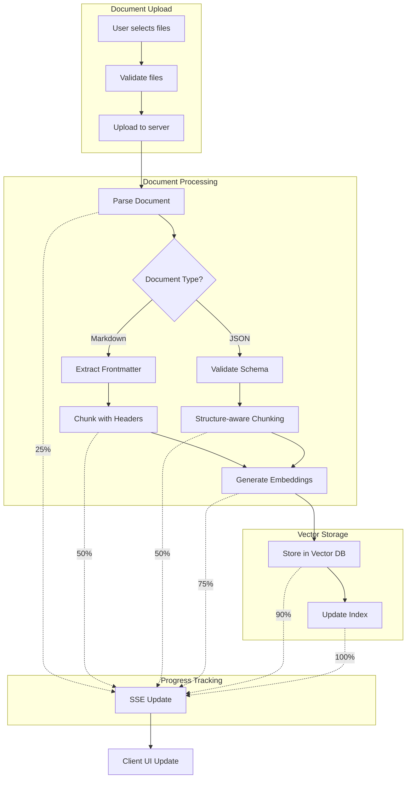

# Comprehensive Implementation Guide: Adding Markdown and JSON Document Processing to Mastra AI RAG Pipeline

## Understanding Mastra AI's Current RAG Architecture

Mastra AI provides a robust TypeScript-based RAG framework with **five key processing stages**: Document Initialization → Chunking → Embedding Generation → Vector Storage → Query & Retrieval. The framework already supports markdown and JSON through its MDocument class with static factory methods like `MDocument.fromMarkdown()` and `MDocument.fromJSON()`, making our implementation a natural extension rather than a complete overhaul.

The current architecture uses a unified vector store API supporting multiple databases (PgVector, Pinecone, Qdrant, etc.) and provides sophisticated features like metadata extraction, reranking, and hybrid search capabilities. Our implementation will leverage these existing capabilities while adding a dedicated upload interface with progress tracking.

## Vertical Slice Architecture for Document Upload Feature

### Feature Organization Structure

```
/src/features/document-upload/
├── upload/
│   ├── UploadPage.tsx              # UI component (< 300 lines)
│   ├── UploadController.ts         # API endpoints (< 200 lines)
│   ├── UploadService.ts            # Business logic (< 300 lines)
│   ├── UploadValidator.ts          # Zod schemas (< 150 lines)
│   └── UploadTypes.ts              # Type definitions (< 100 lines)
├── processing/
│   ├── DocumentProcessor.ts        # Core processor (< 250 lines)
│   ├── MarkdownStrategy.ts         # Markdown handler (< 200 lines)
│   ├── JsonStrategy.ts             # JSON handler (< 200 lines)
│   └── ProcessingQueue.ts          # Async processing (< 300 lines)
├── progress/
│   ├── ProgressTracker.ts          # SSE implementation (< 200 lines)
│   ├── ProgressStore.ts            # State management (< 150 lines)
│   └── ProgressTypes.ts            # Progress schemas (< 100 lines)
└── tests/
    ├── upload.test.ts              # Upload tests
    ├── processing.test.ts          # Processing tests
    └── fixtures/                   # Test data
```

This structure ensures each file stays under 500 lines while maintaining clear separation of concerns within the vertical slice.

## TDD Workflow Implementation

### Test-First Development Approach

Start with failing tests for the core document processing functionality:

```typescript
// tests/processing.test.ts
describe('DocumentProcessor', () => {
  describe('Markdown Processing', () => {
    it('should extract frontmatter and chunk content', async () => {
      const processor = new DocumentProcessor();
      const mockMarkdown = `---
title: RAG Implementation Guide
tags: ['rag', 'ai', 'typescript']
date: 2025-01-15
---

# Introduction

This guide covers RAG implementation...`;

      const result = await processor.process(mockMarkdown, 'markdown');
      
      expect(result.frontmatter).toEqual({
        title: 'RAG Implementation Guide',
        tags: ['rag', 'ai', 'typescript'],
        date: new Date('2025-01-15')
      });
      expect(result.chunks).toHaveLength(1);
      expect(result.chunks[0].text).toContain('This guide covers');
    });

    it('should handle progress updates during processing', async () => {
      const progressCallback = jest.fn();
      const processor = new DocumentProcessor({ onProgress: progressCallback });
      
      await processor.process(mockMarkdown, 'markdown');
      
      expect(progressCallback).toHaveBeenCalledWith({
        stage: 'parsing',
        progress: 25
      });
      expect(progressCallback).toHaveBeenCalledWith({
        stage: 'chunking',
        progress: 50
      });
    });
  });
});
```

### Mock File Creation Strategy

```typescript
// tests/fixtures/mockFactory.ts
export class DocumentTestFactory {
  static createMockFile(content: string, filename: string, type: string): File {
    const blob = new Blob([content], { type });
    return new File([blob], filename, { type, lastModified: Date.now() });
  }

  static createMarkdownWithFrontmatter(overrides: Partial<MarkdownMetadata> = {}) {
    const metadata = {
      title: 'Test Document',
      date: '2025-01-15',
      tags: ['test'],
      ...overrides
    };
    
    return `---
${Object.entries(metadata).map(([k, v]) => `${k}: ${JSON.stringify(v)}`).join('\n')}
---

# ${metadata.title}

Test content for document processing.`;
  }
}
```

## TypeScript Implementation with Zod Validation

### Core Document Schemas

```typescript
// upload/UploadValidator.ts
import { z } from 'zod';

// Markdown frontmatter validation
export const MarkdownFrontmatterSchema = z.object({
  title: z.string().min(1, "Title is required"),
  date: z.string().datetime().optional(),
  tags: z.array(z.string()).optional(),
  draft: z.boolean().default(false),
  author: z.string().optional(),
  category: z.string().optional()
});

// Document upload validation
export const DocumentUploadSchema = z.object({
  file: z.instanceof(File).refine(
    (file) => file.size <= 50 * 1024 * 1024,
    "File size must be less than 50MB"
  ),
  type: z.enum(['markdown', 'json']),
  metadata: z.object({
    source: z.string().optional(),
    tags: z.array(z.string()).optional()
  }).optional()
});

// Processing result schema
export const ProcessingResultSchema = z.object({
  documentId: z.string().uuid(),
  chunks: z.array(z.object({
    id: z.string(),
    text: z.string(),
    embedding: z.array(z.number()).optional(),
    metadata: z.record(z.unknown())
  })),
  status: z.enum(['completed', 'failed', 'partial']),
  errors: z.array(z.string()).optional()
});

export type DocumentUpload = z.infer<typeof DocumentUploadSchema>;
export type ProcessingResult = z.infer<typeof ProcessingResultSchema>;
```

### Document Processing Service

```typescript
// processing/DocumentProcessor.ts
import { MDocument } from '@mastra/core';
import { embed } from 'ai';
import { openai } from '@ai-sdk/openai';

export class DocumentProcessor {
  constructor(
    private config: ProcessorConfig,
    private progressTracker: ProgressTracker
  ) {}

  async process(
    content: string, 
    type: 'markdown' | 'json',
    documentId: string
  ): Promise<ProcessingResult> {
    try {
      // Step 1: Parse document (25%)
      await this.progressTracker.update(documentId, {
        stage: 'parsing',
        progress: 25,
        status: 'processing'
      });

      const doc = type === 'markdown' 
        ? MDocument.fromMarkdown(content)
        : MDocument.fromJSON(JSON.parse(content));

      // Step 2: Chunk document (50%)
      await this.progressTracker.update(documentId, {
        stage: 'chunking',
        progress: 50,
        status: 'processing'
      });

      const chunks = await doc.chunk({
        strategy: type === 'markdown' ? 'markdown' : 'recursive',
        size: 512,
        overlap: 50,
        extract: { metadata: true }
      });

      // Step 3: Generate embeddings (75%)
      await this.progressTracker.update(documentId, {
        stage: 'embedding',
        progress: 75,
        status: 'processing'
      });

      const embeddings = await this.generateEmbeddings(
        chunks.map(c => c.text)
      );

      // Step 4: Store in vector database (100%)
      await this.progressTracker.update(documentId, {
        stage: 'storing',
        progress: 90,
        status: 'processing'
      });

      await this.storeChunks(chunks, embeddings, documentId);

      await this.progressTracker.update(documentId, {
        stage: 'completed',
        progress: 100,
        status: 'completed'
      });

      return ProcessingResultSchema.parse({
        documentId,
        chunks: chunks.map((chunk, i) => ({
          id: `${documentId}-${i}`,
          text: chunk.text,
          embedding: embeddings[i],
          metadata: chunk.metadata
        })),
        status: 'completed'
      });

    } catch (error) {
      await this.progressTracker.update(documentId, {
        stage: 'error',
        progress: 0,
        status: 'failed',
        error: error.message
      });
      throw error;
    }
  }

  private async generateEmbeddings(texts: string[]): Promise<number[][]> {
    const { embeddings } = await embed({
      model: openai.embedding('text-embedding-3-small'),
      values: texts
    });
    return embeddings;
  }

  private async storeChunks(
    chunks: ChunkResult[],
    embeddings: number[][],
    documentId: string
  ): Promise<void> {
    await this.config.vectorStore.upsert({
      indexName: this.config.indexName,
      vectors: embeddings.map((embedding, i) => ({
        id: `${documentId}-${i}`,
        vector: embedding,
        metadata: {
          text: chunks[i].text,
          documentId,
          ...chunks[i].metadata
        }
      }))
    });
  }
}
```

## Upload Page Implementation with Progress Tracking

### React Component with SSE Progress Updates

```typescript
// upload/UploadPage.tsx
import React, { useState, useEffect } from 'react';
import { useDropzone } from 'react-dropzone';

interface ProcessingState {
  [documentId: string]: {
    filename: string;
    stage: 'upload' | 'parsing' | 'chunking' | 'embedding' | 'storing' | 'completed' | 'error';
    progress: number;
    status: 'pending' | 'processing' | 'completed' | 'failed';
    error?: string;
  };
}

export const DocumentUploadPage: React.FC = () => {
  const [processingStates, setProcessingStates] = useState<ProcessingState>({});
  const [activeConnections, setActiveConnections] = useState<Map<string, EventSource>>(new Map());

  const { getRootProps, getInputProps, isDragActive } = useDropzone({
    accept: {
      'text/markdown': ['.md', '.markdown'],
      'application/json': ['.json']
    },
    maxSize: 50 * 1024 * 1024, // 50MB
    onDrop: handleFileUpload
  });

  async function handleFileUpload(acceptedFiles: File[]) {
    for (const file of acceptedFiles) {
      const formData = new FormData();
      formData.append('file', file);
      formData.append('type', file.name.endsWith('.json') ? 'json' : 'markdown');

      try {
        const response = await fetch('/api/documents/upload', {
          method: 'POST',
          body: formData
        });

        const { documentId } = await response.json();
        
        // Initialize processing state
        setProcessingStates(prev => ({
          ...prev,
          [documentId]: {
            filename: file.name,
            stage: 'upload',
            progress: 0,
            status: 'processing'
          }
        }));

        // Connect to SSE for progress updates
        connectToProgressStream(documentId);

      } catch (error) {
        console.error('Upload failed:', error);
      }
    }
  }

  function connectToProgressStream(documentId: string) {
    const eventSource = new EventSource(`/api/documents/${documentId}/progress`);
    
    eventSource.onmessage = (event) => {
      const progress = JSON.parse(event.data);
      setProcessingStates(prev => ({
        ...prev,
        [documentId]: {
          ...prev[documentId],
          ...progress
        }
      }));

      if (progress.status === 'completed' || progress.status === 'failed') {
        eventSource.close();
        activeConnections.delete(documentId);
      }
    };

    activeConnections.set(documentId, eventSource);
    setActiveConnections(new Map(activeConnections));
  }

  useEffect(() => {
    // Cleanup connections on unmount
    return () => {
      activeConnections.forEach(connection => connection.close());
    };
  }, []);

  return (
    <div className="document-upload-container">
      <div {...getRootProps()} className="dropzone">
        <input {...getInputProps()} />
        {isDragActive ? (
          <p>Drop the files here...</p>
        ) : (
          <p>Drag & drop markdown or JSON files here, or click to select</p>
        )}
      </div>

      <div className="processing-list">
        {Object.entries(processingStates).map(([docId, state]) => (
          <ProcessingCard key={docId} documentId={docId} state={state} />
        ))}
      </div>
    </div>
  );
};

const ProcessingCard: React.FC<{ documentId: string; state: ProcessingState[string] }> = ({ 
  documentId, 
  state 
}) => {
  const stageLabels = {
    upload: 'Uploading',
    parsing: 'Parsing document',
    chunking: 'Creating chunks',
    embedding: 'Generating embeddings',
    storing: 'Storing in database',
    completed: 'Complete',
    error: 'Failed'
  };

  return (
    <div className={`processing-card ${state.status}`}>
      <h3>{state.filename}</h3>
      <div className="progress-info">
        <span>{stageLabels[state.stage]}</span>
        <span>{state.progress}%</span>
      </div>
      <div className="progress-bar">
        <div 
          className="progress-fill" 
          style={{ width: `${state.progress}%` }}
        />
      </div>
      {state.error && (
        <div className="error-message">{state.error}</div>
      )}
    </div>
  );
};
```

## Mermaid Architecture Diagrams

### Complete RAG Processing Flow



## Conventional Commits for Feature Development

### Branch and Commit Strategy

```bash
# Create feature branch
git checkout -b feature/RAG-001/document-upload-ui

# Initial setup commits
git commit -m "feat(upload): scaffold vertical slice structure for document upload"
git commit -m "test(upload): add TDD tests for document processing pipeline"
git commit -m "feat(upload): implement Zod schemas for document validation"

# Core implementation
git commit -m "feat(processing): add markdown frontmatter extraction with metadata"
git commit -m "feat(processing): implement JSON structure-aware chunking strategy"
git commit -m "feat(upload): create React upload component with drag-and-drop"
git commit -m "feat(progress): implement SSE progress tracking for document processing"

# Integration and testing
git commit -m "test(e2e): add integration tests for upload-to-retrieval flow"
git commit -m "perf(vector-db): optimize batch embedding storage operations"
git commit -m "docs(api): document upload endpoints and progress SSE format"
```

## Definition of Done Checklist

### RAG Feature Completion Criteria

**Functional Requirements:**
- [ ] Upload page accepts markdown and JSON files up to 50MB
- [ ] Progress tracking shows all 5 processing stages in real-time
- [ ] Markdown frontmatter properly extracted and validated
- [ ] JSON documents maintain structure during chunking
- [ ] Vector embeddings generated and stored successfully
- [ ] Documents retrievable through Mastra's query tool

**Code Quality:**
- [ ] All files under 500 lines with clear separation
- [ ] TypeScript types complete with no `any` usage
- [ ] Zod validation for all external inputs
- [ ] 90%+ test coverage for processing logic
- [ ] Error handling with user-friendly messages

**Documentation:**
- [ ] API endpoints documented with examples
- [ ] Mermaid diagrams in README
- [ ] Junior developer setup guide included
- [ ] Performance benchmarks recorded

## Junior Developer Implementation Steps

### Week 1: Foundation
1. Set up development environment with Mastra AI
2. Create vertical slice folder structure
3. Write failing tests for document processing
4. Implement basic file upload endpoint

### Week 2: Core Processing
1. Build document processor with strategy pattern
2. Add markdown and JSON parsing logic
3. Integrate with Mastra's MDocument API
4. Implement progress tracking with SSE

### Week 3: UI and Integration
1. Create React upload component
2. Add drag-and-drop functionality
3. Connect progress updates to UI
4. Test end-to-end flow

### Week 4: Polish and Optimization
1. Add comprehensive error handling
2. Optimize chunking strategies
3. Complete documentation
4. Performance testing and optimization

## Production Deployment Considerations

### Configuration Management

```typescript
// config/rag.config.ts
export const ragConfig = {
  upload: {
    maxFileSize: 50 * 1024 * 1024,
    allowedTypes: ['markdown', 'json'],
    batchSize: 5
  },
  processing: {
    chunkSize: 512,
    chunkOverlap: 50,
    embeddingModel: 'text-embedding-3-small',
    vectorStore: 'pgvector'
  },
  progress: {
    updateInterval: 1000,
    connectionTimeout: 30000
  }
};
```

This implementation guide provides a complete roadmap for adding markdown and JSON document processing to your Mastra AI RAG pipeline. The vertical slice architecture ensures clean separation of concerns, while the TDD approach guarantees reliable functionality. The progress tracking system provides excellent user experience, and the comprehensive documentation makes it accessible to junior developers.